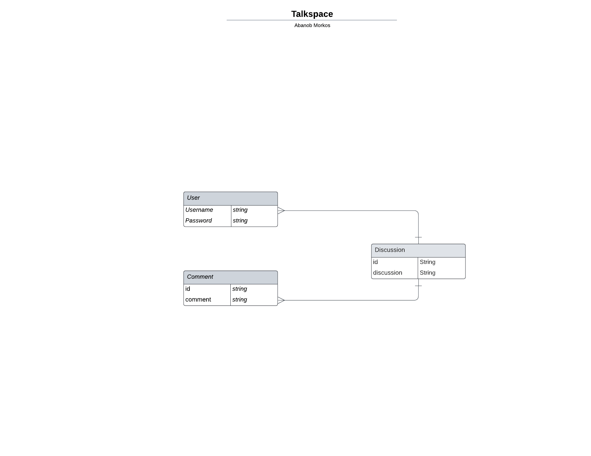

## TalkSpace 

Welcome to TalkSpace , a discussion app where users can post and engage in meaningful discussions. 

## Table of Contents
- [Technologies Used](#technologies-used)
- [Getting Started](#getting-started)
- [Features](#features)
- [ERD] (#erd)
- [Endpoints](#endpoints)
- [ERD](#)


## Technologies used:

- TypeScript
- prisma
- mongodb

## Features:

1. User Authentication to securely sign up and log in users.
2. Users have the ability to create, read, update, and delete discussions.
3. Users are able to comment on discussions. 

## ERD


## Endpoints

| Endpoint       | Method | Purpose                  |
| -------------- | ------ | ------------- |
| /              | GET    | Retrieve all  discussions |
| /discussion/:id| GET    | Retrieves a single discussion |
| /discussion/:id/update| PUT | Updates selected discussion  |
| /discussion/create| POST    | Creates a discussion |
| /discussion/:id/delete| DELETE    | Deletes a discussion |

## Getting Started

To get started with the backend set up , follow these steps:

1. Clone this repository.
2. Navigate to the `talkspace` directory.
3. Install dependencies using your preferred package manager:

   ```bash
   npm install
   # or
   yarn install